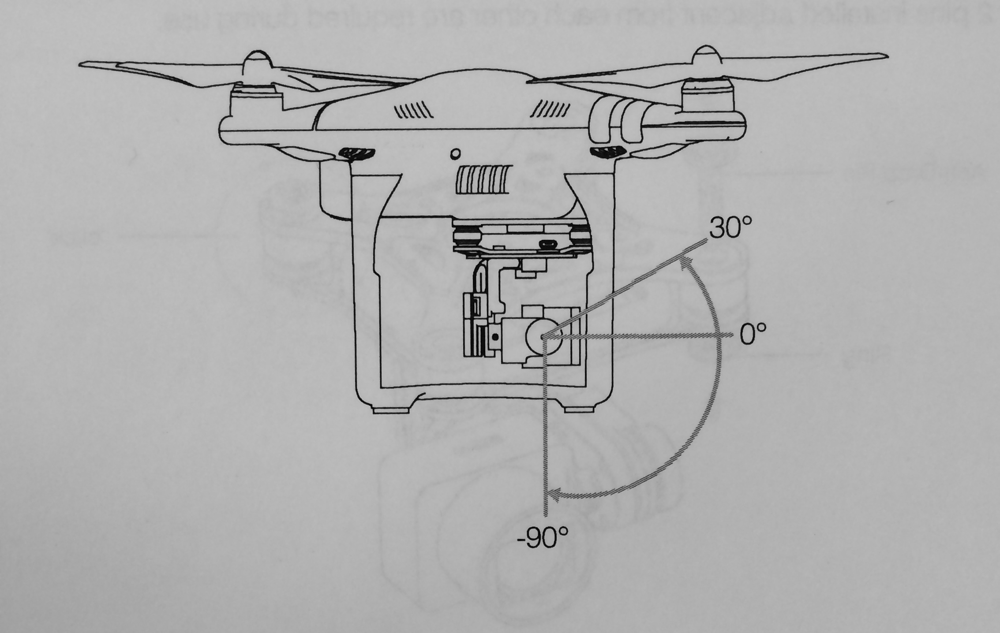
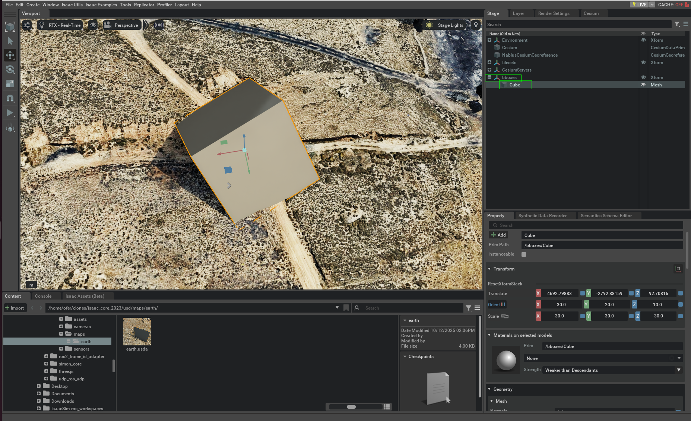
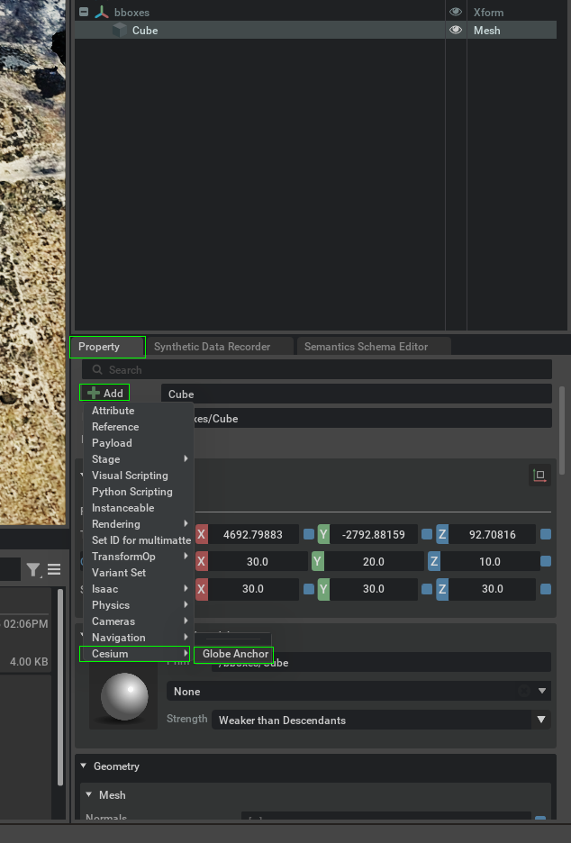
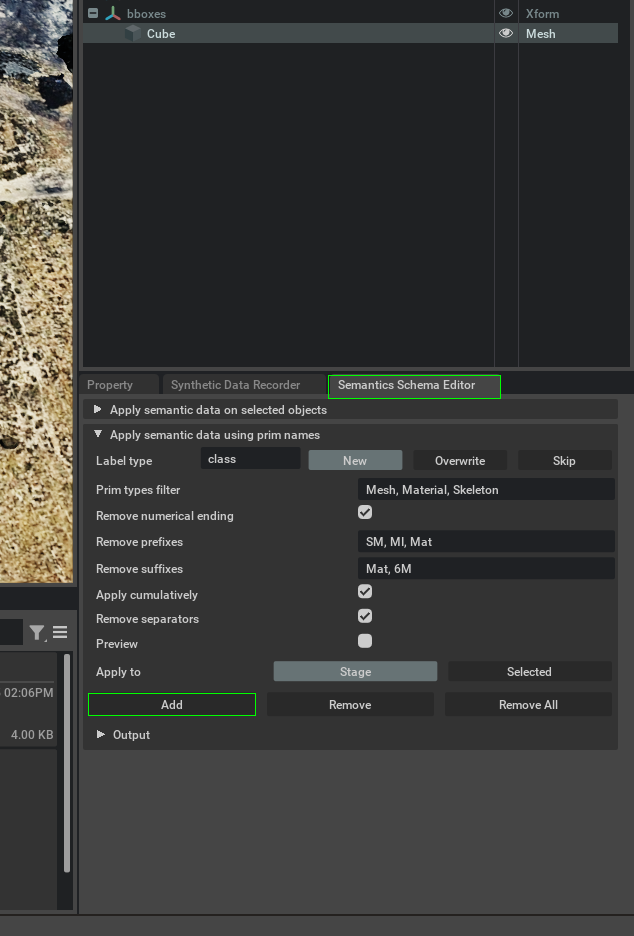

# Isaac Core 🌎📸

A tool aimed for simulating camera image view from a real 3dTiles scanning of the relevant location from a gps and orientation inputs.
<br>
This can be used to simulate areal unmaned vehicles. 
<br>
This tool is based on NVIDIA's **Isaac Sim 2023** and includes ros2 integration
<br>


---

## Table of Contents

1. [System Requirements](#system-requirements)  
1. [Docker Workflow (Optional)](#docker-workflow-optional)
1. [Running the Simulation](#running-the-simulation)  
1. [Simulation Flags](#simulation-flags)  
1. [Special configurations](#Special-configurations)
1. [ROS2 input topics](#ros2-input-topics)  
1. [ROS2 outputs topics](#ros2-outputs-topics)  
1. [Take pictures](#take-pictures)  
1. [Auto completion in vscode](#auto-completion-in-vscode)
1. [Extension Overview](#Extension-Overview)
1. [Using Bbox](#Using-Bbox)
1. [Deleting cesium cache](#Deleting-cesium-cache)

---

## System Requirements

<details>
<summary><strong>NVIDIA GPU — Driver 535+ recommended for Isaac Sim 2023.1+</strong></summary>

```bash
sudo apt-get remove --purge '^nvidia-.*'
sudo apt update
sudo apt install nvidia-driver-535
sudo reboot
nvidia-smi
```

</details>

<details>
<summary><strong>Ubuntu 22.04 LTS or later</strong></summary>

No additional setup required — just ensure you're running Ubuntu 22.04.

</details>

<details>
<summary><strong>Docker 20.10+ & Docker Compose v2 (and NVIDIA Container Toolkit)</strong></summary>

Install Docker & Compose:
```bash
sudo apt install docker docker-compose-v2
```

Install Vulkan & NVIDIA Container Toolkit:
```bash
sudo apt install vulkan-tools nvidia-container-toolkit
```

</details>

<details>
<summary><strong>ROS 2 Humble — Installed automatically inside the base Docker image</strong></summary>

Optional: install locally for development outside Docker.

Install ROS 2 Humble:
```bash
sudo apt update && sudo apt install locales
sudo locale-gen en_US en_US.UTF-8
sudo update-locale LC_ALL=en_US.UTF-8 LANG=en_US.UTF-8
export LANG=en_US.UTF-8

sudo apt install software-properties-common
sudo add-apt-repository universe
sudo apt update && sudo apt install curl -y
sudo curl -sSL https://raw.githubusercontent.com/ros/rosdistro/master/ros.key -o /usr/share/keyrings/ros-archive-keyring.gpg
echo "deb [arch=$(dpkg --print-architecture) signed-by=/usr/share/keyrings/ros-archive-keyring.gpg] http://packages.ros.org/ros2/ubuntu $(lsb_release -cs) main" | sudo tee /etc/apt/sources.list.d/ros2.list > /dev/null

sudo apt update
sudo apt install ros-humble-desktop
```

Install Isaac Sim ROS 2 workspace:
```bash
sudo apt install ros-humble-rmw-fastrtps-cpp ros-humble-rmw-cyclonedds-cpp python3-rosdep python3-rosinstall python3-rosinstall-generator python3-wstool build-essential python3-colcon-common-extensions ros-humble-vision-msgs
git clone https://github.com/isaac-sim/IsaacSim-ros_workspaces.git ~/IsaacSim-ros_workspaces
cd ~/IsaacSim-ros_workspaces/humble_ws
rosdep install -i --from-path src --rosdistro humble -y
colcon build
echo "source /opt/ros/humble/setup.bash" >> ~/.bashrc
```

Add to `~/.bashrc`:
```bash
export RMW_IMPLEMENTATION=rmw_fastrtps_cpp
export ROS_DOMAIN_ID=13
source ~/IsaacSim-ros_workspaces/humble_ws/install/setup.bash
```

</details>

<details>
<summary><strong>Isaac core custom ros2 interfaces</strong></summary>

Copy the files into the humble workspace in your home dir:
```bash
cp -r ./simulation/ros2_interfaces/* ~/IsaacSim-ros_workspaces/humble_ws/src/isaac_ros2_messages/
```

Rebuild the relevant package:
```bash
cd ~/IsaacSim-ros_workspaces/humble_ws/
colcon build --packages-select isaac_ros2_messages
source install/setup.bash 
```

Check that the interface is available:
```bash
ros2 interface show isaac_ros2_messages/msg/FrameBboxes 
ros2 interface show isaac_ros2_messages/msg/Bbox 
```

</details>

<details>
<summary><strong>Setup Extensions</strong></summary>

Modify Omniverse config file:
```bash
OMNI_CONFIG_FILE="$ISAACSIM_PATH/apps/omni.isaac.sim.python.kit"
if [ -f "$OMNI_CONFIG_FILE" ]; then
    echo "Updating Omniverse config file..."
    if ! grep -q 'cesium.omniverse' "$OMNI_CONFIG_FILE"; then
        echo -e '\n[dependencies]\n"cesium.omniverse" = {}\n"cesium.usd.plugins" = {}\n"omni.anim.curve" = {}' >> "$OMNI_CONFIG_FILE"
    fi

    if ! grep -q 'useFabricSceneDelegate' "$OMNI_CONFIG_FILE"; then
        echo -e '\n[settings.app]\nuseFabricSceneDelegate = true' >> "$OMNI_CONFIG_FILE"
    fi
fi
```

Install in Isaac Sim GUI the extensions: `cesium`, `ros2 bridge`

Then run:
```bash
cp -r ~/.local/share/ov/data/exts/v2/cesium.* "$ISAACSIM_PATH/exts"
cp -r extensions/* $ISAACSIM_PATH/exts/
```

</details>

<details>
<summary><strong>install isaac python modules</strong></summary>

```bash
~/.local/share/ov/pkg/isaac_sim-2023.1.1/python.sh -m pip install pyproj transforms3d
```

</details>

---

## Docker Workflow (Optional)

<details>
<summary>Architecture Overview</summary>

### 1. Base Image (`build_base_image.sh`)
- Starts from NVIDIA’s Isaac Sim 4.5 container.
- Installs ROS 2 Humble and builds the workspace.
- Launches Isaac Sim once to warm up caches.
- Commits a warm-start image for faster future boots.

### 2. Simulation Image (`build_simulation_image.sh`)
- Builds on the base image.
- Adds your extensions and ROS configuration.
- Launches your scene and commits the container once extensions are initialized.

</details>

### Build Docker Images

Step 1: Build the base image
```bash
./Docker/build_base_image.sh
```
Step 2: Build the simulation image with extensions
```bash
./Docker/build_simulation_image.sh
```

---
<details>
<summary>what the repo does and how to develop in it</summary>

Isaac Core provides a modular simulation framework built around Isaac Sim 2023.1.1 and ROS 2 Humble. It allows developers
to launch custom USD scenes, inject optional components (cameras, sensors, vehicles), and stream data through ROS topics in real time.

The simulation logic is centralized in `Sim_app.py`, which dynamically loads USD assets based on CLI flags
and configures the scene with extensions, viewport settings, and sensor graphs. Optional modules like range sensors or ROS cameras are injected via a clean argument parser and resolved through `sim_utils.py`.

USD assets are organized by type (maps, vehicles, cameras, publishers), and can be composed at runtime to build complex environments.
The repo supports Cesium tilesets, and includes utilities for patching USD files or rewriting attributes dynamically.

Development is designed to be flexible:
- Add new USDs to the `Usd/` folder and reference them via `--usd_path`
- Extend the simulation by adding new nodes to `Script_nodes/` or new extensions under `Extensions/`
- Use `omniverse_utils.py` to manipulate the stage, set camera views, or inject references
- Configure simulation behavior through constants in `sim_utils.py`, including sensor parameters and launch settings
</details>


## Running the Simulation

### Run Inside Docker

```bash
xhost +
./run_docker.sh
```

### Run Locally on Your Host

```bash
ISAACSIM_PYTHON ./simulation/main_sim.py --usd-path $PWD/usd/maps/earth/earth.usda --com-ros
```

---

## Simulation Flags

| Flag                     | Description                                                         |
|--------------------------|---------------------------------------------------------------------|
| `--usd-path <file.usda>` | Load a specific USDA scene file                                     |
| `--headless`             | Run Isaac Sim without GUI                                           |
| `--com-ros`              | Expect lat, lon, alt, roll, pith, yaw inputs using ros              |
| `--com-udp`              | Expect lat, lon, alt, roll, pith, yaw inputs using udp              |
| `--distance-sensor`      | Add range sensor to simulation (output is on ros topic)             |
| `--bbox-publisher`       | Publish bbox data for each object specified                         |
| `--sat`                  | enables to capture current frames to and output path via a ros topic|

---

## Special configurations
under simulation/consts.py you can change:
```bash     
GIMBAL_ROLL_DEG                 # gimbal roll angel
GIMBAL_PITCH_DEG                # gimbal pitch angel
GIMBAL_YAW_DEG                  # gimbal yaw angel
RESOLUTION_WIDTH                # frame width resolution
RESOLUTION_HEIGHT               # frame height resolution
CAMERA_FOV                      # camera's FOV           
FOCAL_LENGTH                    # camera's focal length

TILESETS_HTTP_SERVER_URL        # cesium server address

LASER_MIN_RANGE                 # distance sensor min range
LASER_MAX_RANGE                 # distance sensor max range

MAX_OUTPUTS_ROS_HRZ             # data topic publish frequency       
GLOBAL_POSE_TOPIC_NAME          # global pose data topic name
LASER_TOPIC_NAME                # distance sensor topic name
BBOXES_TOPIC_NAME               # bbox data topic name
IMAGE_PUBLISHER_TOPIC_NAME      # image rgb topic name
```

### Gimbal Angle (Reference Image)

The gimbal angle is based on the following photo:



There is always a gimbal subscriber that is subscribed to `/isaac_core/gimbal` that updates the gimbal angel values while "in the air".

The isaac sim expects msgs there with values for gimbal roll, pitch, yaw, and it update the gimbal live.

here is a bash command to publish a msg on a topic for manual usage (adjust the values):
```bash
ros2 topic pub /isaac_core/gimbal isaac_ros2_messages/msg/Gimbal "{roll: 0.0, pitch: 0.0, yaw: 0.0}"
```

---

## ROS2 input topics
These are the MAVRos topic the isaac sim would be subscribing to if you choose com-ros

| Topic                                | Type                                | Description                                      |
|--------------------------------------|-------------------------------------|--------------------------------------------------|
| `/mavros/global_position/global`     | `sensor_msgs/NavSatFix`             | Read LLA from MAVRos                             |
| `/mavros/local_position/pose`        | `geometry_msgs/PoseStamped`         | Read orientaion from MAVRos                      |
| `/isaac_core/sat`                    | `isaac_ros2_messages/msg/SATOutput` | wait for an output path to save frame            |
| `/isaac_core/gimbal`                 | `isaac_ros2_messages/msg/Gimbal`    | Read gimbal angels and adjust gimbal dynamically |


------

## ROS2 outputs topics

| Topic                                | Type                                 | Description                 |
|--------------------------------------|--------------------------------------|-----------------------------|
| `/isaac_core/global_pose`            | `geometry_msgs/GeoPoseStamped`       | Camera's global position (overriding quaternions with RPY, x=roll, y=pitch, z=yaw, w=not used)    |
| `/isaac_core/distance_sensor`       | `sensor_msgs/Range`                  | Simulated laser range data  |
| `/isaac_core/camera/image_rgb`       | `sensor_msgs/Image`                  | Camera feed from simulation |
| `/isaac_core/bbox`                   | `isaac_ros2_messages/msg/FrameBboxes`| BBOX data per object        |


---

## Take pictures
You can enable the take picture with the `--sat` flag

Then the topic `/isaac_core/sat` will expect msg's that their content is a file path.

If the isaac sim process have permission for that path it will save there a png of the current frame.

here is a bash command to publish a msg on a topic for manual usage:
```bash
ros2 topic pub /isaac_core/sat isaac_ros2_messages/msg/SATOutput "{output_path: '<your path>'}"
```


## Auto completion in vscode
<details>
<summary>Expand to show more on setup</summary>
`.vscode` folder is unique for each machine depending on the extensions installed, in order to get the right folder follow those steps:

1. Open isaac sim
1. window
1. Extensions
1. Plus button for new extension
1. New extension Template project (call it a random name)
1. Copy .vscode folder from that project and paste it in this directory

`app` - It is a folder link to the location of your *Omniverse Kit* based app.
If `app` folder link doesn't exist or broken it can be created again. For better developer experience it is recommended to create a folder link named `app` to the *Omniverse Kit* app installed from *Omniverse Launcher*. Convenience script to use is included.

Run:
```
./link_app.sh --path $ISAACSIM_PATH
```

Now reopen vscode in this folder an wait 30 seconds ~ for auto-completion.
</details>


## Extension Overview

The isaac core repo has some custom extension and nodes for isaac sim 2023.1.1

### `omni.sim.math`

<details>
<summary><strong>Node: OgnSimGlobalPositionToLocalPosition</strong></summary>

- **Purpose**: Converts global GPS coordinates and orientation (roll, pitch, yaw) into local ENU position and quaternion, all calculation are with ZYX angle notation.
- **Inputs**:
  - `global_position` — `[lat, lon, alt]` in degrees/meters (WGS84)
  - `global_orientation` — `[roll, pitch, yaw]` in radians, ZYX
  - `enu_reference` — `[lat, lon, alt]` reference point  
  - `offset_roll/pitch/yaw` — degrees  
- **Outputs**:
  - `local_position` — `[x, y, z]` in meters in ENU system around reference
  - `local_orientation` — quaternion `[qx, qy, qz, qw]`
  - `global_position` — `[lat, lon, alt]` in degrees/meters (WGS84)
  - `global_orientation` — `[roll, pitch, yaw]` in degrees, ZYX

</details>


### `omni.sim.position`

<details>
<summary><strong>Node: OgnSimUDPToGlobalPosition</strong></summary>

- **Purpose**: Receives UDP packets and parses them into global position and orientation.
- **Inputs**:
  - `udp_port` — integer port number  
- **Outputs**:
  - `global_position` — `[lat, lon, alt]` in degrees/meters (WGS84) 
  - `global_orientation` — `[roll, pitch, yaw]` in radians, ZYX

</details>

<details>
<summary><strong>Node: OgnSimROS2ToGlobalPosition</strong></summary>

- **Purpose**: Subscribes to a ROS2 topic and extracts global position and orientation.
- **Inputs**:
  - `LLA topic_name` — ROS2 topic string  
  - `orientation topic_name` — ROS2 topic string  
- **Outputs**:
  - `global_position` — `[lat, lon, alt]` in degrees/meters (WGS84)
  - `global_orientation` — `[roll, pitch, yaw]` in radians, ZYX

</details>


### `omni.sim.sensors`

<details>
<summary><strong>Node: OgnSimROS2GlobalPosePublisher</strong></summary>

- **Purpose**: Publishes global position and orientation to a ROS2 topic using `GeoPoseStamped`.
- **Inputs**:
  - `global_position` — `[lat, lon, alt]` in degrees/meters (WGS84)
  - `global_orientation` — `[roll, pitch, yaw]` in degrees, ZYX
  - `hz` — publish frequency  
  - `topic_name` — ROS2 topic string  
- **Outputs**: None (publishes to ROS2)  

</details>

<details>
<summary><strong>Node: OgnSimROS2RangePublisher</strong></summary>

- **Purpose**: Publishes range sensor data to a ROS2 topic using `sensor_msgs/Range`.
- **Inputs**:
  - `max range` — float value in meters  
  - `min range` — float value in meters  
  - `publish Rate HZ` — publish frequency
  - `topicName` — ROS2 topic string  
- **Outputs**: None (publishes to ROS2)  

</details>

<details>
<summary><strong>Node: OgnSimROS2ImagePublisher</strong></summary>

- **Purpose**:  
  Publishes RGB images from a render product to ROS2 topics.  
  Subscribes to a raw RGB topic (`/isaac_core/raw_rgb`) and republishes the images at a configurable rate to `/isaac_core/image_rgb`.

- **Inputs**:
  - `enabled` — Enable or disable image publishing  
  - `context` — Render context used to retrieve images  
  - `frameId` — Frame ID used in the ROS2 message header  
  - `nodeNamespace` — Optional ROS2 node namespace  
  - `rawTopic` — Input topic for raw RGB images (`/isaac_core/raw_rgb`)  
  - `repubTopic` — Output topic for republished images (`/isaac_core/image_rgb`)  
  - `queueSize` — ROS2 publisher/subscriber queue size  
  - `renderProductPath` — USD path to the render product (camera output)  
  - `publishRateHZ` — Publish frequency in Hz  
  - `execIn` — Execution trigger to initiate image publishing  

- **Outputs**:  
  None (publishes to ROS2)

- **Behavior**:
  - Initializes a Replicator ROS2 RGB writer and a republisher node on first run.  
  - Periodically republishes incoming images with an incrementing `frame_id`.  
  - Supports dynamic rate updates through `publishRateHZ`.  
  - Automatically resets and releases all ROS2 resources when disabled.

</details>

<details>
<summary><strong>Node: OgnSimROS2Gimbal</strong></summary>

- **Purpose**: Read gimbal angels values from the topic `/isaac_core/gimbal`.
- **Inputs**:
  - `Gimbal Topic` — topic name to read gimbal values from
- **Outputs**:
  - `roll` - roll in degrees
  - `pitch` - pitch in degrees
  - `yaw` - yaw in degrees

</details>


### `omni.sim.template`

<details>
<summary><strong>Node: OgnSimTemplate</strong></summary>

- **Purpose**: Starter template for new OmniGraph nodes.

</details>


## Using Bbox

You can enable the Bbox option with the `--bbox-publisher` flag.

In order to add a new object to get its bbox data, you need to follow there steps:

<details>
<summary><strong>Adding your object under the `bboxes` Xfrom</strong></summary>

- Open the .usda file you intend to open, for example `earth.usda`
- Add your object to where ever you want it to be
  * You can find free models to use at `Sketchfab.com`
- In the stage tab, drag and drop your object prim into the /bboxes Xform
  * Notice: that if your .usda doest have a /bboxes xform in its top hierarchy you will need to create one
- Make sure your object looks like the cube in the image, placed in the world and its prim path is under /bboxes


</details>

<details>
<summary><strong>Adding `Global anchor` to your object</strong></summary>

- Go to the `property` tab of the object and click `Add+`
- Then you need to hover above `cesium` and a pop up window will appear
- Then click the `Global anchor` option, and make sure when you scroll down you see it


</details>

<details>
<summary><strong>Adding the correct semantics to your object</strong></summary>

- Go to the `Semantics Schema Editor` tab of the object, there you will see the same window as in the image
  * Notice: Make sure all your fields look like in the image, the `apply to` needs to be on stage and not selected
- Click `Add`


</details>

#### Make sure to save the .usda file after adding your object and setting it

## Deleting cesium cache
* While running isaac sim overnight, some computers will have trouble opening it again after closing the overnight session.
* That is because cesium has a cache file, that is flushed (deleted) after the isaac sim is shutdown, but for long session that file wont be deleted, and it might get so big (600-700GB), that the next time you try to open isaac sim it wont manage to open the file causing isaac sim to fail.
* the cache file is located on .cache and can be deleted like this: `rm -rf ~/.cache/ov/cesium-request-cache.sqlite-wal`