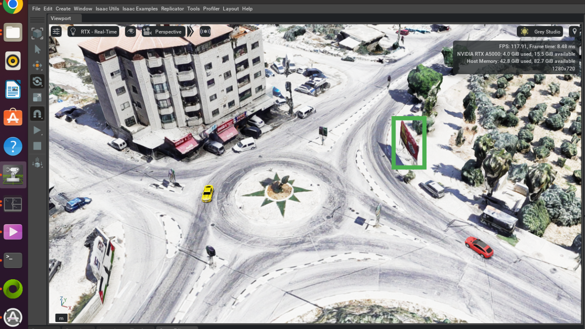

# Isaac Core 🌎📸

A tool aimed for simulating camera image view from a real 3dTiles scanning of the relevant location from a gps and orientation inputs.
<br>
This can be used to simulate areal unmaned vehicles. 
<br>
This tool is based on NVIDIA's **Isaac Sim 2023** and includes ros2 integration
<br>


---

## Table of Contents

1. [System Requirements](#system-requirements)  
1. [Docker Workflow (Optional)](#docker-workflow-optional)
1. [Running the Simulation](#running-the-simulation)  
1. [Simulation Flags](#simulation-flags)  
1. [ROS2 outputs topics](#ros2-outputs-topics)  
1. [Take pictures](#take-pictures)  

---


## System Requirements

- **NVIDIA GPU** — Driver **535+** recommended for Isaac Sim 2023.1+  
- **Ubuntu 22.04 LTS or later**
- **Docker 20.10+ & Docker Compose v2 (and NVIDIA Container Toolkit)**
- **ROS 2 Humble** — Installed automatically inside the base Docker image.  
  Optional: install locally for development outside Docker.
- **Setup Extensions**

<details>
<summary>Install NVIDIA Driver</summary>

```bash
sudo apt-get remove --purge '^nvidia-.*'
sudo apt update
sudo apt install nvidia-driver-535
sudo reboot
nvidia-smi
```
</details>

<details>
<summary>Install Docker & Compose</summary>

```bash
sudo apt install docker docker-compose-v2
```
</details>

<details>
<summary>Install Vulkan & NVIDIA Container Toolkit</summary>

```bash
sudo apt install vulkan-tools nvidia-container-toolkit
```
</details>

<details>
<summary>Install ROS 2 Humble (local, optional)</summary>

```bash
sudo apt update && sudo apt install locales
sudo locale-gen en_US en_US.UTF-8
sudo update-locale LC_ALL=en_US.UTF-8 LANG=en_US.UTF-8
export LANG=en_US.UTF-8

sudo apt install software-properties-common
sudo add-apt-repository universe
sudo apt update && sudo apt install curl -y
sudo curl -sSL https://raw.githubusercontent.com/ros/rosdistro/master/ros.key -o /usr/share/keyrings/ros-archive-keyring.gpg
echo "deb [arch=$(dpkg --print-architecture) signed-by=/usr/share/keyrings/ros-archive-keyring.gpg] http://packages.ros.org/ros2/ubuntu $(lsb_release -cs) main" | sudo tee /etc/apt/sources.list.d/ros2.list > /dev/null

sudo apt update
sudo apt install ros-humble-desktop
```
</details>

<details>
<summary>Setup Extensions</summary>

```bash
cp -r extensions/* $ISAACSIM_PATH/exts/
```
</details>

---

## Docker Workflow (Optional)

<details>
<summary>Architecture Overview</summary>

### 1. Base Image (`build_base_image.sh`)
- Starts from NVIDIA’s Isaac Sim 4.5 container.
- Installs ROS 2 Humble and builds the workspace.
- Launches Isaac Sim once to warm up caches.
- Commits a warm-start image for faster future boots.

### 2. Simulation Image (`build_simulation_image.sh`)
- Builds on the base image.
- Adds your extensions and ROS configuration.
- Launches your scene and commits the container once extensions are initialized.

</details>

### Build Docker Images

Step 1: Build the base image
```bash
./Docker/build_base_image.sh
```
Step 2: Build the simulation image with extensions
```bash
./Docker/build_simulation_image.sh
```

---
<details>
<summary>what the repo does and how to develop in it</summary>

Isaac Core provides a modular simulation framework built around Isaac Sim 2023.1.1 and ROS 2 Humble. It allows developers
to launch custom USD scenes, inject optional components (cameras, sensors, vehicles), and stream data through ROS topics in real time.

The simulation logic is centralized in `Sim_app.py`, which dynamically loads USD assets based on CLI flags
and configures the scene with extensions, viewport settings, and sensor graphs. Optional modules like range sensors or ROS cameras are injected via a clean argument parser and resolved through `sim_utils.py`.

USD assets are organized by type (maps, vehicles, cameras, publishers), and can be composed at runtime to build complex environments.
The repo supports Cesium tilesets, and includes utilities for patching USD files or rewriting attributes dynamically.

Development is designed to be flexible:
- Add new USDs to the `Usd/` folder and reference them via `--usd_path`
- Extend the simulation by adding new nodes to `Script_nodes/` or new extensions under `Extensions/`
- Use `omniverse_utils.py` to manipulate the stage, set camera views, or inject references
- Configure simulation behavior through constants in `sim_utils.py`, including sensor parameters and launch settings
</details>


## Running the Simulation

### Run Inside Docker

```bash
xhost +
./run_docker.sh
```

### Run Locally on Your Host

```bash
ISAACSIM_PYTHON ./simulation/main_sim.py --usd-path $PWD/usd/maps/earth/earth.usda --com-ros
```

---

## Simulation Flags

| Flag                     | Description                                                  |
|--------------------------|--------------------------------------------------------------|
| `--usd-path <file.usda>` | Load a specific USDA scene file                              |
| `--headless`             | Run Isaac Sim without GUI                                    |
| `--com-ros`              | Expect lat, lon, alt, roll, pith, yaw inputs using ros       |
| `--com-udp`              | Expect lat, lon, alt, roll, pith, yaw inputs using udp       |
| `--range-sensor`         | Add range sensor to simulation (output is on ros topic)      |

## Special configurations
under simulation/consts.py you can change:
```bash
GIMBAL_ANGLE = 0.0              # TODO
TILESETS_HTTP_SERVER_URL = "http://10.20.15.122:8088"
OUTPUTS_ROS_HRZ = 0.0           # TODO
RESOLUTION_WIDTH = 1280
RESOLUTION_HEIGHT = 720
CAMERA_FOV = 78.1               # degrees           
FOCAL_LENGTH = 22.7885          # mm             
```

---

## ROS2 outputs topics

| Topic                               | Type                        | Description                 |
|-------------------------------------|-----------------------------|-----------------------------|
| `/isaac_core/odom`  (TODO)          | `geometry_msgs/PoseStamped` | Camera's odometry           |
| `/isaac_core/gps`  (TODO)           | `sensor_msgs/NavSatFix`     | Camera's lat, lon, alt      |
| `/isaac_core/laser_distance_sensor` | `sensor_msgs/Range`         | Simulated laser range data  |
| `/isaac_core/camera/image_raw`      | `sensor_msgs/Image`         | Camera feed from simulation |
| `/isaac_core/bbox`  (TODO)          | `TODO`                      | BBOX data                   |


---

## Take pictures
TODO
